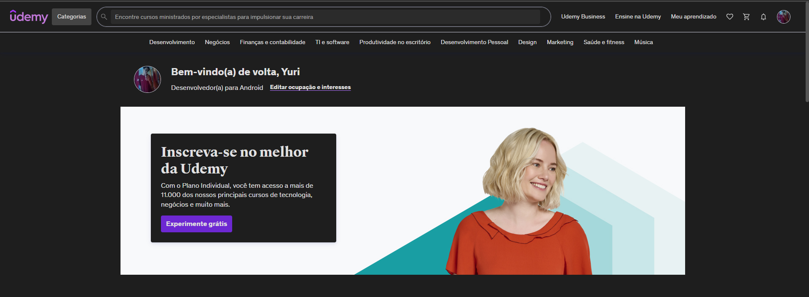

# 🎨 Udemy Dark Theme

**Um tema escuro minimalista para o Udemy** - Estudar de madrugada não precisa doer os olhos! 😎

## ✨ Features
- 🌙 Modo escuro em todas as páginas
- 🎨 Cores ajustadas para melhor contraste
- 🔥 Leve e sem bloat
- 🔄 Atualização automática quando o site carrega

## 🚀 Instalação
1. `git clone https://github.com/Yuri-Rodriguees/Udemy.git`
2. Abra o Chrome em `chrome://extensions/`
3. Ative o **Modo Desenvolvedor**
4. Clique em **Carregar sem compactação**
5. Selecione a pasta do projeto

## 📜 Licença
MIT - use como quiser!

---

😊 **Dica:** Aperte `CTRL + SHIFT + R` se o tema não aplicar imediatamente!